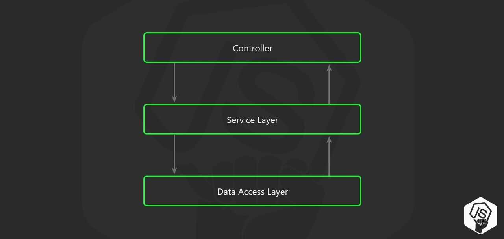

# 🏝️ 2023.08.03 TIL
## 이룬 일
- 해커톤 팀 첫 회의 참여
- UMC 프로젝트 API 개발 시작
    - Router, Controller 초기 세팅
- 좋아하는 문구의 근원 찾기 🍀
    - 문구를 작성한 블로그: [🌝〰️💥〰️🌟](https://jeonge.tistory.com/154)
> Shoot for the moon. Even if you miss it, you will land among the stars. - Les Brown

> 달을 향해 쏴라. 당신이 달을 놓치더라도 당신은 여전히 별들 사이에 있을 것이다. -레스 브라운
## 배운 부분
### NodeJS 프로젝트 폴더 구조 및 실행순서
- 구조
```
| userController.js: 이메일 체크 구현
| userDao.js: DB 쿼리문 작성
| userProvider.js: 서비스 로직 구현
| userRoute.js
| userService.js: 서비스 로직 구현
```

- 실행순서
1. `config>express.js`에서 router 연결
2. `src>App`으로 이동
```
Router > Controller > Provider&Service > Dao
```

## 필요한 부분
### API 개발 방향
텅 비어 있는 코드를 어떻게 채워야 할 것인가에 대해 고민이 크다. 팀원분에게 진행방향을 공유해달라고 부탁드렸다. 함께 앞으로 나아가야지. 모르는 것을 부끄러워하지 않고 질문할 수 있는 이가 되자. 그렇게 변하고 있어 다행이다!

모르는 것을 모르는 상태로 머물러 있는 자가 더 어리석은 자임을 명심하자. 