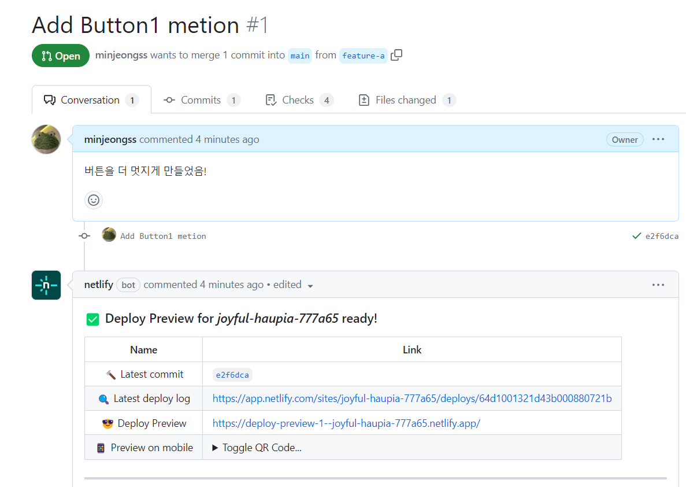

# 🏝️ 2023.08.07 TIL
## 이룬 일
- 리액트 강의 듣기 (Part 6: CSS)
- 커낵트 강의 계획 세우기 및 피드백 받기
    - 계획을 잘 세웠으며, 리액트를 착실하게 공부하고 있다는 칭찬을 받았다! 🌟
- 츠바키 문구점 읽기
> 먹을 가는 작업에는 진정 효과가 있다고 한다. 나는 오랜만에 의식이 엷어지는 듯한 기분 좋은 감각을 온몸으로 맛보았다.

> 주위에 아무도 없어서 나지막하게 축하해, 하고 속삭였다. 내 목소리가 들렸는지 어쨋는지 모르겠지만, 그 순간 남풍이 부드럽게 지나가고 물색 종이가 기분 좋게 춤을 추었다.

## 배운 부분
### 배포 branch 선택
- release branch 존재의 이유

리액트 프로젝트를 배포하는 과정에서 branch를 선택하는 과정이 존재했다. 기존에 개발하던 브랜치는 master만 존재해서 굳이 선택할 필요는 없었다. 

하지만 이 과정에서 `release branch`의 존재 이유를 깨닫게 되었다.

지속적인 개발을 위해선 작업용 branch와 사용자가 이용하고 있는 화면을 구성하는 배포용 branch가 존재할 것이다. 예를 들어, master는 작업용 branch이며 release는 배포용 branch가 되는 셈이다.

- release branch 만드는 방법

```
git checkout -b release
```

### [리액트 프로젝트 배포하는 방법](https://create-react-app.dev/docs/deployment#static-server)
- 한 번의 배포: 정적 서버 이용하기
- 지속적인 배포: netlify 이용하기

### Netlify를 이용한 Git 사용법
branch를 생성해 변화된 내용을 커밋해준다. 다음은 feature-a branch를 새로 생성해 main branch에 pull request를 남긴 모습이다.

netlify bot이 자동으로 url을 생성해준다. 변화된 내용을 main 또는 release에 반영하기 전에, 직접 화면상으로 볼 수 있게 해주는 효과를 가지고 있다. 신기해!
