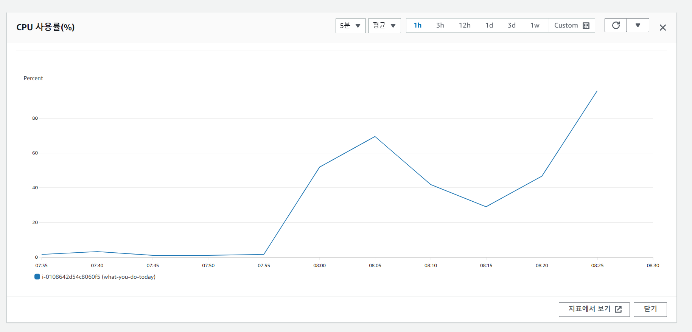

# 🏝️ 2023.08.12 TIL
## 이룬 일
- [독서] 창백한 푸른점 & 츠바키 문구점 필사하기
- [해커톤-귀농귀농] 초기 개발 환경 셋팅하기
- [프로젝트-오늘뭐하니] Remote SSH 연결하기
## 해결한 부분
### Remote host 파일 위치 확인
```
cd /var/www
cd what-you-do-today
```
## 배운 부분
### npm VS yarn
해커톤 귀농귀농팀 프론트 파트에서 초기 개발 셋팅을 완료했다. clone해서 가져왔는데, `yarn start` 명령어가 작동하지 않는 것을 확인했다.

문제의 원인은 팀원이 사용하는 것이 npm이라는 것이다. npm과 yarn은 동시에 사용되지 않는 편이다. 둘 중에 하나를 택해서 개발을 진행하는데, 규모가 작고 빠르게진행해야 하는 해커톤이기에 각자가 사용하는 것에 집중해 모두 사용하기로 결정했다.

프론트 공부를 시작하며, npm과 yarn의 차이점을 빠르게 배우고 지나가서 중요하게 생각하지 않았는데 역시 실제 개발에선 사소한 선택도 충돌의 원인이 될 수 있다는 것을 배웠다.
### 원격저장소 추가하기
Remote SSH로 원격 접속을 성공했다. 
- 작업환경을 살펴보기
```
git remote -v
```
해당 서버에 어떠한 원격장치들이 연결되어 있는지를 확인할 수 있는 것이다. 이제 내 원격장치의 연결이 필요하다. 작업한 코드를 fork한 나의 레파지토리에 올려야 하기 때문이다.
- fork한 주소의 원격저장소 추가
```
git remote add minjeong git@github.com/minjeongss/레파지토리이름.git
```
 📌 참고 주소: [링크](https://velog.io/@adguy/git-%EC%97%AC%EB%9F%AC%EA%B0%9C-%EC%9B%90%EA%B2%A9-%EC%A0%80%EC%9E%A5%EC%86%8C-%EC%82%AC%EC%9A%A9%ED%95%B4%EC%84%9C-%ED%94%84%EB%A1%9C%EC%A0%9D%ED%8A%B8-%ED%95%9C%EA%B0%9C%EC%97%90-%EC%97%B0%EA%B2%B0%ED%95%98%EA%B8%B0)
## 필요한 부분
### SSH 연결하기
VScode에서 Remote Explorer을 통해 원격에 연결을 성공했다. 하지만 파일의 위치로 이동한 순간 연결이 끊어졌다. VSCode에 미숙해서 발생한 오류라 생각하고, Intellij로 이동해 다시 연결을 시도했으나 실패했다.

EC2에서 발생한 오류였던 것이다. UMC 스터디에서도 느꼈지만, 정말 연약한 서버이다.

- 원인 파악

CPU 사용률이 100%다. 이것에 의해 SSH 연결이 되지 않던 것이었다.


- 해결 방법
    - EC2 stop -> start: [참고주소](https://nan-sso-gong.tistory.com/32)
    - swap memory 증가: [참고주소](https://white-world.tistory.com/408)