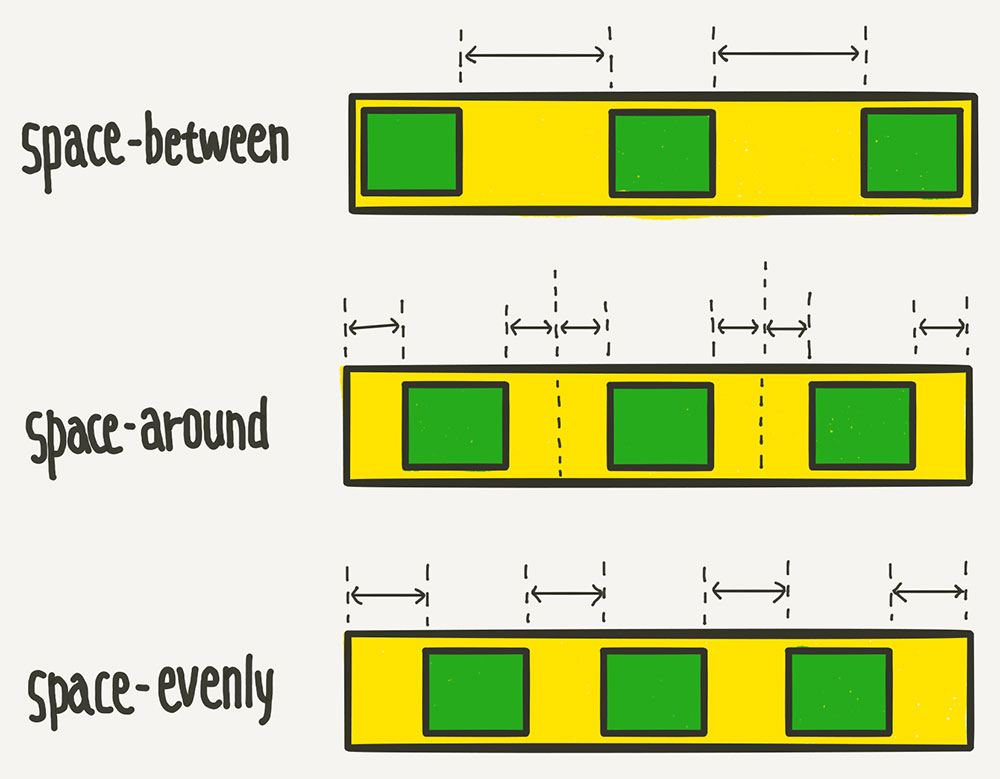
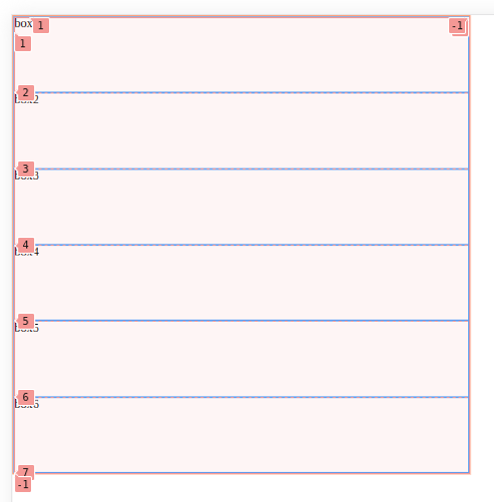

# ⛱️ 2024.07.18 TIL

## 이룬 일

- 데브코스 수업 수강
  - 오전: flex
  - 오후: grid 및 실습

## 배운 부분

### 위치 정하기(position, transform)

- static
  - 기본
- relative
  - 원래의 위치에서 벗어나 배치되도록 설정(부유되는 특성)
  - 주로 absolute의 부모에 해당
- absolute
  - static이 아닌 요소를 찾아 부모 기준 설정
  - 주로 relative를 부모로 설정
- fixed
  - 브라우저 화면 특정 부분에 고정되어 움직이지 않도록 설정
  - 브라우저 전체화면인 viewport가 부모에 해당
- sticky
  - 브라우저 스크롤링할 때 특정 영역에 고정되어 고정되어 보이도록 설정

#### transform

position의 absolute 좌표를 찍는 것봐 transform의 translate가 더 빠르다.

- translate: x,y축을 기준으로 위치 변경
- rotate: 호전 각도
- scale: 크기
- skew 기울기, 비틀기
- perspective
  - 원근법을 설정해 3D 공간에 깊이감을 줌
  - 부모에게 할당하고, 직계 자손이 사용하도록 설정
  - 크기
    - 100px: 큰 변화를 보이는 경우
    - 900-1000px: 큰 변화를 보이지 않는 경우

### 순서 정하기(z-index, order)

#### z-index

0보다 높은 것을 할당하면 위로 올라가게 된다. 음수가 아닌 양수로 올라가도록 설정해야 한다.

- 단위
  - 999: 헤더, 햄버거
  - 100으로 단위 설정: 우선순위 설정

#### order

각 아이템의 시각적 나열 순서를 결정한다. 단, HTML 자체의 구조를 변경하는 것이 아니기에 접근성 측면에서 주의해야 한다.

### 요소 배치하기(flex, grid)

#### flex

- [참고주소](https://studiomeal.com/archives/197)
- container
  - display:flex
  - flex-direction
    - row(기본값)
    - row-reverse: 시작점이 거꾸로 바뀌게 됨(좌우>우좌)
    - column, column-reverse
  - flex-wrap
    - no-wrap(기본값)
      - 넓이가 컨테이너 넘으면 사이즈 커지지 않음
    - wrap
      - 넓이가 컨테이너 넘으면 줄바꿈하여 넓이 유지함
  - flex-flow
    - flex-direction+flex-wrap 한번에 지정하는 단축 속성
  - justify-content(가로축)
    
  - align-items(수직축)
  - align-content
    - 아이템 행 2줄 이상인 경우 수직축 방향 정렬 결정
- item

  - flex-basis
    - flex 아이템의 기본 크기 설정
  - flex-grow
    - (basis와 존재) 각 컨텐츠의 전체 비율 결정
    - (혼자 존재) 상위 컨텐츠의 빈 영역 비율 나누어서 가지도록 결정
  - flex-shrink

- 축
  - 좌우방향(main axis): justify-content에 사용
  - 위아래 방향(cross axis): align-items에 사용

#### grid

- [참고주소](https://studiomeal.com/archives/533)
- flex와 동일하게 container, item으로 구분
- 처리
  - 명시적 영역
    - grid-template-rows, grid-template-columns
  - 암시적 영역
    - grid-auto-rows, grid-auto-columns
  - 병합
    - grid-column, grid-row
    - 겹치는 구간: z-index로 처리
- 행,단의 줄번호가 존재하여 이를 통해 셀 병합에 사용
  
  단, 암시적 영역에선 줄 번호에 음수가 존재하지 않음

### 가상요소

선택한 요소의 일부에 스타일을 적용해, 새로운 요소를 추가한 것처럼 동작한다.

사용하는 이유는 HTML 구조를 변경하지 않고 추가 컨텐츠를 삽입하고 스타일링할 수 있기 때문이다. 유지보수가 용이해진다.

### 반응형 VS 적응형

#### 반응형

브라우저 사이즈에 따라 자동으로 변환된다. 퍼센트로 설정한 것은 계속 사이즈가 변화하며 브라우저가 레이아웃을 새롭게 배치하게 된다.

#### 적응형

주로 사용되는 브라우저 사이즈를 고정한다. 가로 스크롤이 안뜨도록 노력하며, 적응한 디바이스에 따라 CSS가 달라지게 한다.

- 구분
  - PC
  - 모바일

### 웹 표준 검사

점수화되어 작성한 코드를 평가받을 수 있다.
