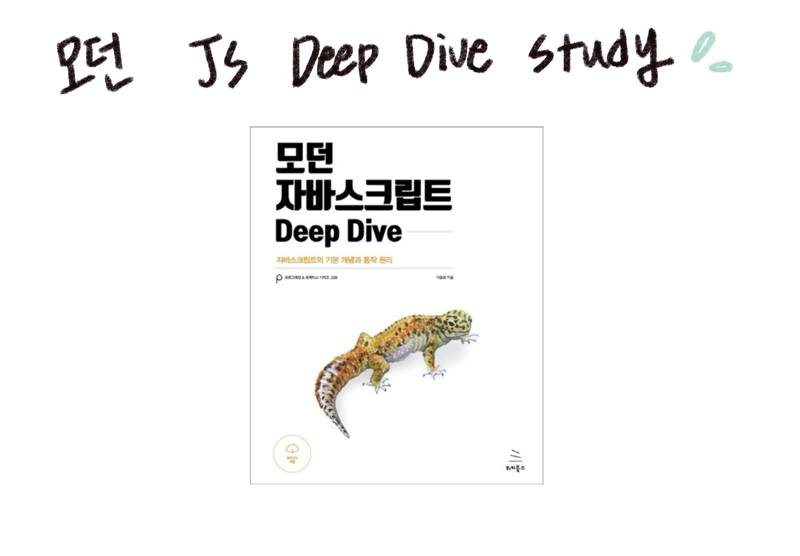

# 🍅 2024.08.01 TIL

## 한줄평

- 벌써 8월이라니! 방학이 한달만 남았다니!
- React를 먼저 공부하고 JS를 공부하려니 DOM 처리가 정말 낯설다. 다들 빠른 시간 안에 뚝딱뚝딱 과제를 내는걸 보면 대단하다.
- 스터디 공지를 게시했다. 스터디 참여는 경험했으나, 스터디장이 되어 스터디를 참여하는 것은 처음이다. 데브코스에서 주도적으로 살기 위해 노력하는 나, 칭찬해.
- 오랜만에 집중해서 공부하니 자기효능감이 올라간다. HAPPY!

## 이룬 일

- 데브코스
  - DOM 처리 강의 듣기
  - 스터디 공지 올리기
    
  - 이번주 배운 내용 개요 정리하기
- [유사 배열 객체 분석](https://github.com/minjeongss/JavaScript-Practice/tree/main/Object)
- [VanillaJS로 React 제작 분석](https://github.com/minjeongss/React-Ts-Practice/tree/main/VanillaJS-Component)
- 수영
  - 평영이 왜이렇게 앞으로 안나가는지 모르겠네

```
데브코스: 9-6
수영:7:30-10:00
분석기: 11:00-2:30
```
